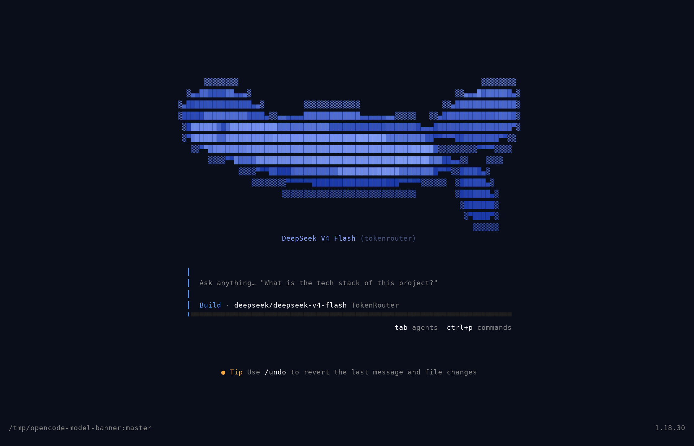
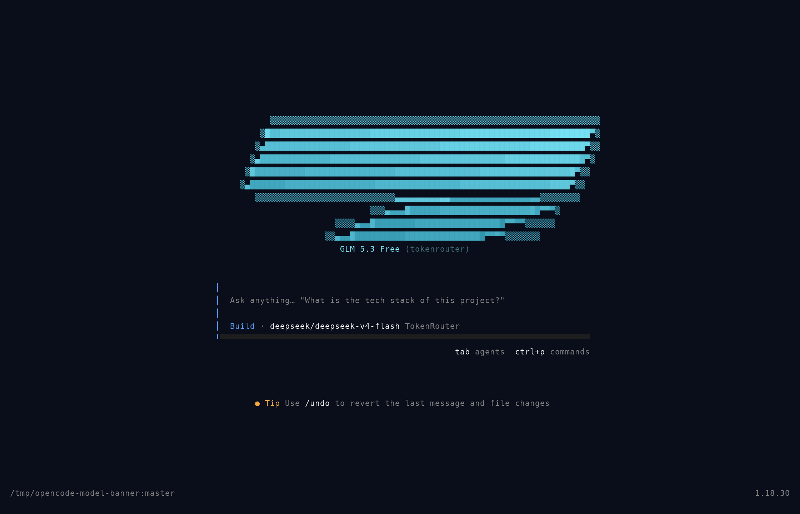
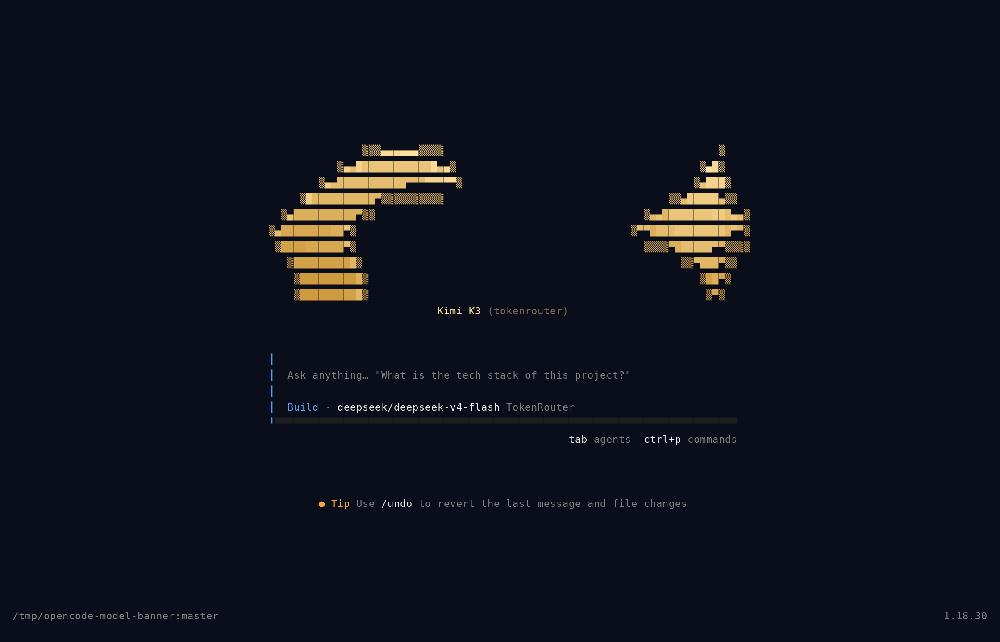
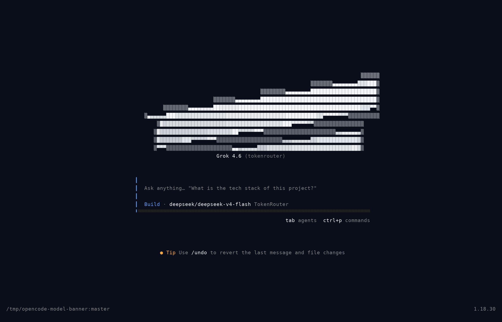
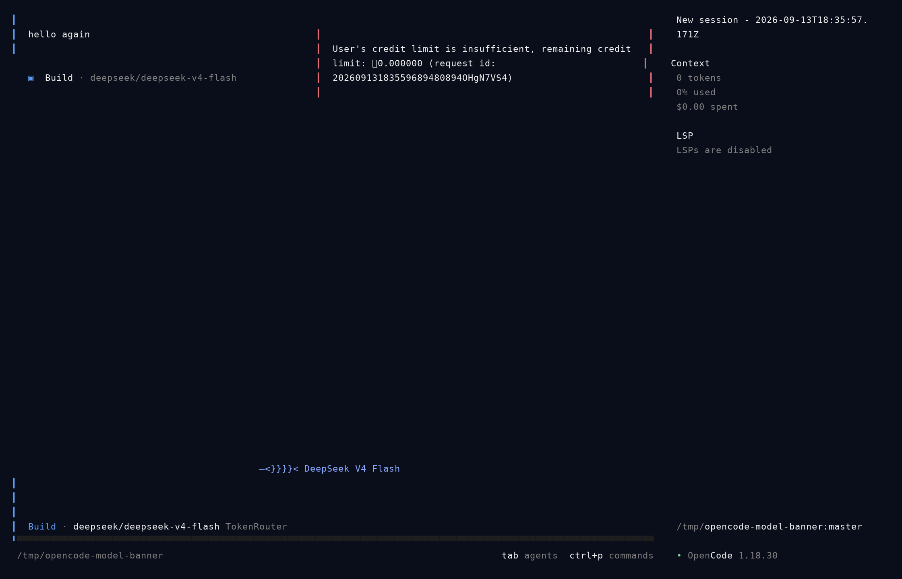
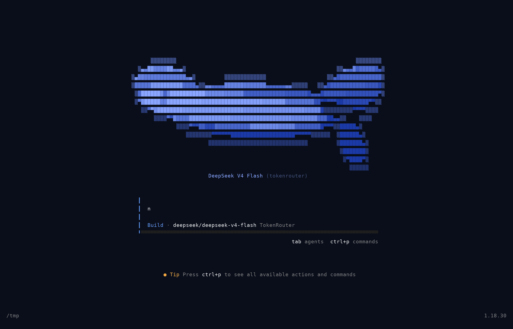

# opencode-model-banner

[](https://github.com/ansonboby/opencode-model-banner/actions/workflows/ci.yml) [](LICENSE)

Per-model ASCII art banners for [opencode](https://opencode.ai) — the TUI coding agent.

Replaces the default opencode wordmark with your **current model's mascot**, rendered as
smooth gradient half-block art:

   ▄▄████████▄▄▄                                                  ▄▄▄████████▄
 ▄███████████████▄▄                                            ▄██████████████
 ███████████████████▄  ▄▄▄▄▄▄█████████████▄▄▄▄▄▄▄▄          ▄█████████████████
 ██████████████████████████████████████████████████████▄▄▄██████████████████▀
 ▀████████████████████████████████████████████████████████▀▀▀▀▀██████████▀▀
   ▀▀█████████████████████████████████████████████████████         ▀▀▀▀
       ▀▀██████████████████████████████████████████████████▄▄
           ▀▀▀███████████████████████████████████████▀▀▀  █████▄
                  ▀▀▀▀▀▀████████████████████▀▀▀▀▀         ██████▄
                                                          ███████▄
                                                           ███████
                                                            ▀████▀
DeepSeek V4 Flash (tokenrouter)

- **Home screen** — large brand mascot with a vertical color gradient + model name
- **Session view** — compact one-line banner above the prompt (`◈ GLM 5.3 Free`)
- **Live switching** — banner swaps within ~0.5s of a ctrl+x m model switch
- Works in the terminal **and** the opencode desktop app (both run the same TUI)

Art for 15 brands — 14 hand-authored brand mascots (wide banner silhouettes)
plus the stock opencode mark, each rendered as *illustrated* half-block art:
layered tones (light face / dark back), diagonal lighting from the upper-left,
rim highlights, and a soft sparse aura:
DeepSeek 🐋whale · Z.ai Z · Kimi ☾crescent · Grok swept-wing · Qwen three rings ·
MiniMax M · OpenAI hex-knot · Gemini sparkle · Claude sunburst · Mistral pixel-M ·
NVIDIA eye · StepFun chevrons · Tencent penguin · ByteDance Doubao heart · opencode.
Unknown models fall back to block-letter art of the model name.

## Example

Home screen, one banner per model (live capture, truecolor):

| DeepSeek | GLM |
|:---:|:---:|
|  |  |

| Kimi | Grok |
|:---:|:---:|
|  |  |

Session view — compact banner above the prompt:



Banners swap live on model switch (~0.5s after the picker writes the state):



## Install

Requires opencode ≥ 1.18 (TUI plugin support).

1. Copy the single-file plugin into your opencode config:

```sh
mkdir -p ~/.config/opencode/plugins
cp plugin/model-banner.tsx ~/.config/opencode/plugins/
```

2. Register it in `~/.config/opencode/tui.jsonc` (create if missing):

```jsonc
{ "plugin": ["./plugins/model-banner.tsx"] }
```

If you already have plugins, append the path to the existing `plugin` array.

3. Restart opencode. Done — no build step, the `.tsx` is loaded directly.

> Requires a truecolor terminal (`TERM=xterm-256color` or similar) for the gradients.

## How it works

The plugin overrides two official TUI plugin slots:

- `home_logo` (replace) — renders the mascot + label above the input box
- `session_prompt` — wraps the stock prompt with a compact banner

Model resolution mirrors opencode's own chain: config `model` →
`~/.local/state/opencode/model.json` `recent[0]` → first provider default.
A `fs.watchFile` on `model.json` feeds a Solid.js signal so banners swap live.
Art matching: exact model → family glob (`glm*`, `kimi*`, …) → provider →
FIGlet-style name art.

## Regenerating art

Art is machine-generated. `plugin/art.ts` comes from SVG sources —
hand-authored brand mascots at banner aspect (730×300 silhouettes, drawn
to read at ~80×17 glyph resolution) in `gen/icons/mascot-*.svg`, plus the
stock opencode mark:

```sh
cd gen && bun install        # resvg for SVG rasterization
bun run svg2art.mjs          # gen/icons/*.svg → art.json (runs + gradient palettes)
python3 emit.py              # art.json → ../plugin/art.ts
cd .. && python3 bundle.py   # inline art.ts into model-banner.tsx
cp plugin/model-banner.tsx ~/.config/opencode/plugins/
```

To add a brand: author `gen/icons/mascot-<brand>.svg` (viewBox `0 0 730 300`,
solid-fill silhouette; verify with `bun run dump-mascot.mjs <brand>`),
add a gradient pair + row budget in `gen/svg2art.mjs`, and a mapping entry in
`gen/emit.py`, then run the pipeline above.

### How the art is made

Each SVG is rendered at 8× supersampling with resvg, preserving authored
fill tones (white = highlight, black = shadow, brand hues = base). Coverage
of each half-block sub-cell becomes `█ ▀ ▄` glyphs (2× vertical resolution).
Coloring: a 16-step vertical gradient anchors the base tone, a diagonal
light term brightens cells toward the upper-left of the ink and darkens the
lower-right, authored tones shift cells 5 steps toward highlight/shadow,
lit edges get a −3 rim highlight and shaded edges a +2 rim, and cells
adjacent to ink but empty emit a sparse `▒` aura. Output is run-length
encoded `[paletteIdx, text]` segments so the plugin ships one `.tsx` with
zero binary assets.

## Repo layout

```
plugin/model-banner.tsx   single-file plugin (install this)
plugin/art.ts             art registry (source of truth, bundled into the above)
plugin/package.json       type-check deps only — not needed at runtime
bundle.py                 inline art.ts into model-banner.tsx (use --check in CI)
plugin/art.test.ts        matchArt behavior tests (bun test)
.github/workflows/ci.yml  bundle sync + build + tests
gen/svg2art.mjs           SVG → gradient half-block converter
gen/emit.py               converter output → art.ts
gen/icons/                hand-authored mascot SVGs (banner-aspect silhouettes)
media/                    screenshots + demo GIF + ansi2png.py (capture→PNG)
```

## License

MIT. Brand names and mascot shapes are stylized trademarks of their
respective owners; the original lobe-icons logo SVGs are retained in
`gen/icons/` for reference and are covered by
[lobe-icons](https://github.com/lobehub/lobe-icons) (MIT). All `mascot-*.svg`
files are original hand-authored silhouettes, used here as functional
identification of the models they depict.
